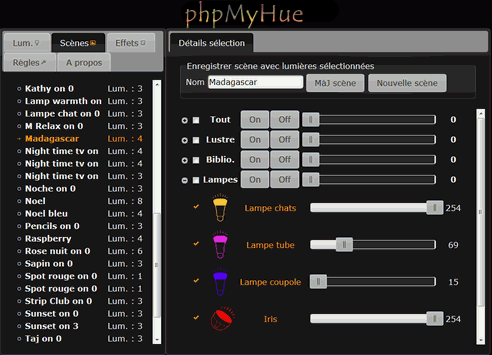
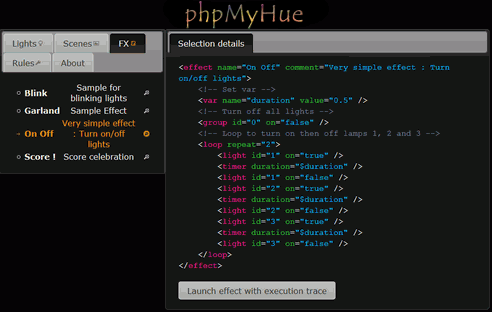
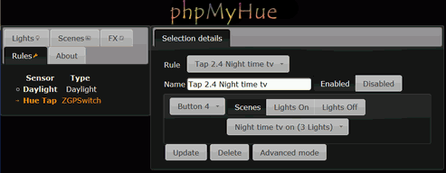

# 

Php web interface and api to manage Philips Hue lights in a local network.

## Functionnalities

* Fully touch device compatible
* **Multi Lang** (translation files can be added locally, see 'lang' directory, and/or be submitted thru an issue to be added to the project, [see wiki](https://github.com/FredBardin/phpMyHue/wiki/Multi-lang))
* **Scripted effects** ready to use or to create (debug mode available) ([see wiki](https://github.com/FredBardin/phpMyHue/wiki/Effects-scripts)) 
* **Scenes update or creation**
* **Full group management**
* **Full rules management** for sensors (simple mode available for **Hue Tap** with additional capabilities)
* Turn on/off, set color and/or brightness for a light or several at once
* Copy color settings between lights (copy to, copy from, switch with)
* Run simple effects
* **Multi Bridge** via several config files (each additional config file must be named 'config_`bridgenanme`.php')
* **Hue API php class available** in 'include/hueapi.php' (see comments in file)
* **Hue cmd web service API available** with 'hueapi_cmd.php' (see comments in file and [wiki](https://github.com/FredBardin/phpMyHue/wiki/Web-services-API))
* Hue effects web service API available with 'main.php' ([see wiki](https://github.com/FredBardin/phpMyHue/wiki/Web-services-API))
* And more ...

**Screenshots**

Lights  

Scenes in french  

Effects  

Rules (simple mode)  

Rules (advanced mode)  

## Installation

1. Copy 'phpMyHue' directory and its content in your web server root directory.
2. Open a browser on your installation url, it should be something like "http://my_web_server/phpMyHue"
    * **Automatic configuration** begins (bridge detection, user creation, ...) : follow information in your browser

If you're asked to proceed manually because automatic setup failed to complete (ie. : local file writing not allowed from your web server), follow the displayed instructions or the ones below :

1. Rename 'include/config.tpl.php' as 'include/config.php'
2. Edit 'include/config.php' and put correct values for '$bridgeip', '$username' and, if needed, for '$lang'.  
    * 'bridgeip' is the ip address of your hue bridge in your lan.  
    * 'username' is a registered user in your hue bridge (cf https://developers.meethue.com/develop/get-started-2/core-concepts).  
    * 'lang' references an existing 'lang/text_"lang".json' file ('en' by default).  

### Licence

MIT

Includes the following plugins also used with MIT licence : jquery-ui, jquery-minicolors

