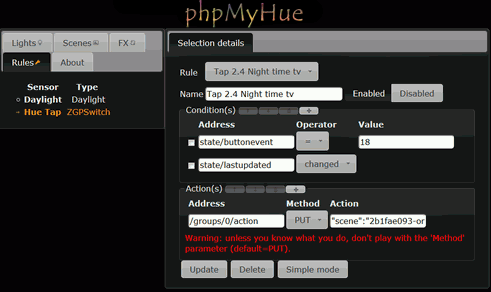

# 

Php web interface to manage Philips Hue lights in a local network.

## Main Functionnalities
* **Full group management**
* **Scenes update or creation**
* Manage and run **scripted effects** (debug mode available) ([see wiki](https://github.com/FredBardin/phpMyHue/wiki/Effects-scripts)) 
* **Full rules management** for sensors (simplified mode available for **Hue Tap** switch with on/off functionalities)
* Set color and/or brightness for a light or several at once
* Copy color settings between lights (copy to, copy from, switch with)
* Switch lights on/off
* Run simple effects
* **Multi Lang** (new translation files can be added and/or be submitted, [see wiki](https://github.com/FredBardin/phpMyHue/wiki/Multi-lang))
* Fully touch device compatible
* **Hue API class available** in 'include/hueapi.php' (see comments in file)
* **Hue cmd web service available** with 'hueapi_cmd.php' (see comments in file and [wiki](https://github.com/FredBardin/phpMyHue/wiki/Web-services))
* Hue effects web service available with 'main.php' ([see wiki](https://github.com/FredBardin/phpMyHue/wiki/Web-services))
* ...

**Screenshots**

Lights           

Scenes in french            

Effects           

Rules (simple mode)        

Rules (advanced mode)       

## Installation
1. Copy 'phpMyHue' directory and its content in your web server.
2. Open a browser on your installation url, it should be something like "http://my_web_server/phpMyHue"
	* **Automatic configuration** begins (bridge detection, user creation, ...) : follow configuration informations in your browser

If you're asked to proceed manually because automatic setup failed to complete (ie. : local file writing not allowed from your web server), follow the displayed instructions or the ones below :

1. Rename 'include/config.tpl.php' as 'include/config.php'
2. Edit 'include/config.php' and put correct values for '$bridgeip', '$username' and, if needed, for '$lang'.  
	* 'bridgeip' is the ip address of your hue bridge in your lan.  
	* 'username' is a registered user in your hue bridge (cf http://www.developers.meethue.com/documentation/api-core-concepts).  
	* 'lang' references an existing 'lang/text_"lang".json' file ('en' by default).  

### Licence
MIT

Includes the following plugins also used with MIT licence : jquery-ui, jquery-minicolors

